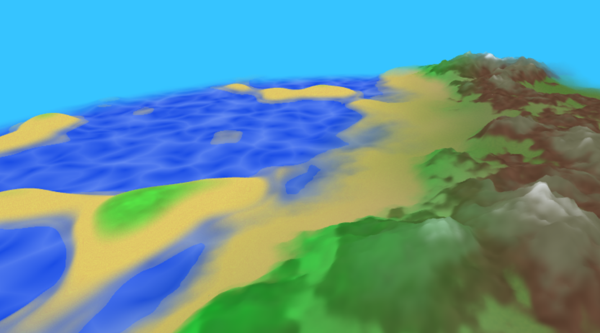

# CIS 566 Homework 1: Noisy Terrain

## Steven Galban, PennKey: sgalban

## Terrain
- My terrain was broken up into 3 different biomes. While I initially planned to have more
that were to be determined using moisture and temperature, time constraints forced me to
use just the 3, which are placed with a one dimensional moisture value. This moisture is generated
through a simple perlin noise function and a qunitic falloff
  - Deserts are found in areas of low moisture. They are fairly flat, with subtle dunes made from
  fractal perlin noise. However, the occasional mesa can also be found. They're generated from fractal
  brownian motion that goes through an incredibly steep falloff that minimizes low values but gives high
  values a flat top. The sand and rock colors were also generated with perlin functions, and were mixed
  between via the height of the terrain.
  - Mountains and plains are in areas of moderate moisture. They are characterized by large flat areas mixed
  with other mountainous areas. The hight map is generated with some simple fbm, but is then cubed to create the feilds.
  I added on more brownian noise to areas of higher elevation to increase the jaggedness without affecting the feilds. More interesting however is the coloration of this biome. The grass is generated with 2 noise functions, one small perlin to make the actual grass, and a larger FBM to add in occasional dirt patches. Going up, the colors (which themselves are mostly made with perlin noise) are determined by height, but to avoid horizontal bands, I perturbed the interpolation
  factor with another fbm call.
  - Areas with low moisture are oceans. The oceans themselves are flat (I wanted to make small waves, but I couldn't get
  that to look right with my islands in the short amount of time I had). The islands are generated with perlin noise that
  goes through the same steep falloff I used to make the mesas. However, here, the noise function is actually subtracted from the terrain, effectively carving out an ocean. Like the other biomes, I used height to determine if the terrain should be colored with water, sand, or grass, but I also added in the sine of time to the interpolation to create
  a tide effect (it's pretty subtle though). The ocean also uses fbm perturbed worley noise (the fbm and worley noise are
  also offset by time) to create a watery effect. A perturbed perlin is also used to change the height of the ocean, giving it a wavy effect (although, it's very subtle);
  - The different biomes are linearly interpolated between. I kept the interpolation between mountains and oceans fairly large
  so that noticable beaches could form at the edges of these biomes.

## Controls
- "Biome Size" allows users to change the size of the biome. The inverse of the input is multiplied with the frequency of the FBM that determines biome placement.
- "Time Multiplier" changes the rate at which time passes. This effects the color and height of the ocean, but also effects the sky color. I implemented an extremely primative day-night cycle (it only changes the color of the sky, which is still solid. I never implemented any sort of sun in my shader), which can be sped up or reversed using this parameter.
- I did implement some simple lambertian shading to my scene. Since the vertices are altered in the shader, I had to approximate the normals by sampling the height in two additional positions close to the vertex position, and then taking a cross product. I then use the position of the sun, which is based on time (but note the sun is not actually rendered) to compute the lambertian factor per fragment. However, on my machine, this entire process is extremely slow, so I added a boolean "Lighting" parameter to disable it entirely and increase the framerate.

## Sources
- My worley noise implementation was copied (though slightly modified) from a version I wrote in CIS460 last semester.
- I referred to the lecture slides for help when writing my FBM and perlin functions.
- I used http://www.iquilezles.org/apps/graphtoy/ to help design some of my falloff functions
- My program wouldn't run if I used an integer uniform in both by vertex and fragment shaders, so I referred to this SO post: https://stackoverflow.com/questions/22593729/accessing-same-named-uniform-in-vertex-and-fragment-shaders-fails. Once I added the highp qualifier it worked.
- I used the DAT.GUI overview (https://workshop.chromeexperiments.com/examples/gui/#1--Basic-Usage) to refresh myself on how to develop the controls.
- I used Inigo Quilez's article on domain warping (https://www.iquilezles.org/www/articles/warp/warp.htm) to help with my water animation.